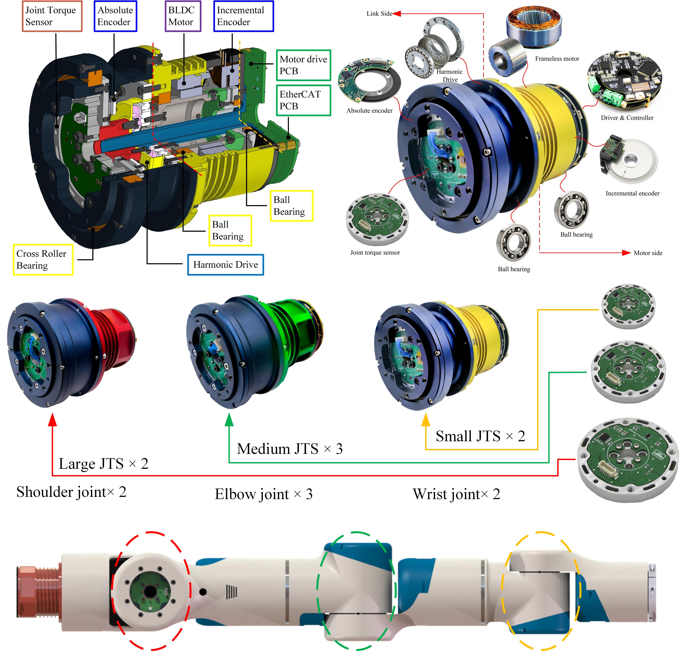
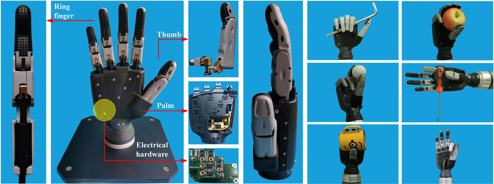
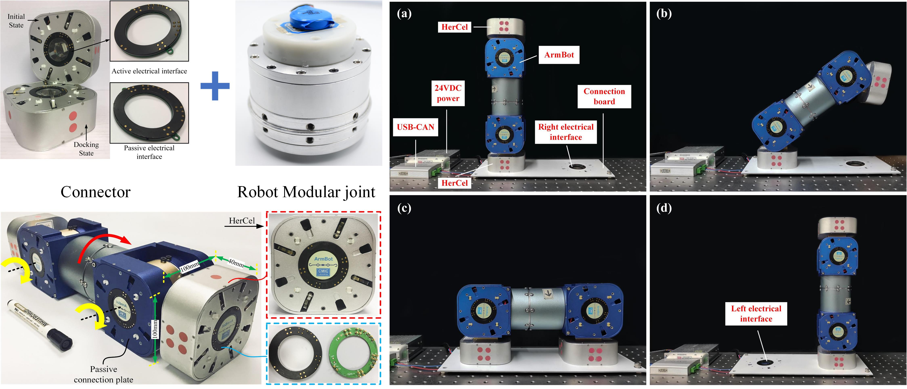

---
# 7-DOF Modular Anthropomorphic Manipulator 
## 1. Structure & Hardware Design
- Design of three size robotic modular joint with embeded joint torque sensor;
- Design of 7-DOF anthropomorphic manipulator;
- Design of electromechanical coupling quick changer.

7-DOF manioulator prototype

## 2. Kinematics & Dynamics Modeling and Simulation
- Arm configuration, forward kinematics, workspace(Reachable & Dexterous) and manipulability anasyis;
- Analytical inverse kinematics solution with arm manifold, free-singularity and joint limits avoidance for 7-DOF manipulator;
- Dynamics modeing and simulation of 7-DOF manipulator.

Dexterous hand prototype

## 3. Flexible Joint Modeling, Parameter Identification, and Compliance Control
- Flexible joint modeing;
- Motor-torque coefficient identification, friction identification, stiffness and damping identification;
- Full-state feedback control.

## 4. 7-DOF Manipulator Compliance Control
- Joint space impedance control;
- Cartesian space impedance control;
- Nullspace impedance control.

## 5. Related Media 
- [Joint torque sensor](https://youtu.be/-RE1b1pkxbM)
- [Robotic modular joint](https://youtu.be/8-BTJ6ExhIA)
- [7-DOF manipulator](https://youtu.be/ncxNLygdOeQ)

---

# Dexterous Hand Design and Compliant Control 

Dexterous hand prototype

## Related Media
- [Cutkosky test of dexterous](https://www.youtube.com/watch?v=M8hLrL9GSCc&ab_channel=%E7%94%B0%E6%96%B0%E6%89%AC)
# Self-Reconfigurable Modular Robot 

  
  3-DOF modular self-reconfigurable robot

