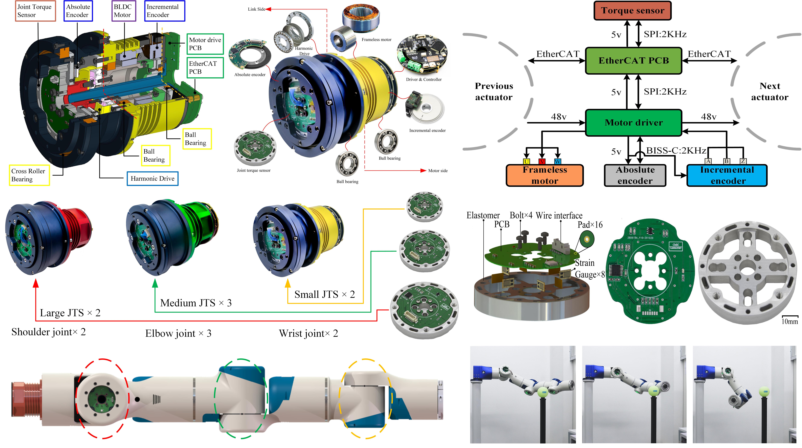

---
# 7-DOF Modular Anthropomorphic Manipulator 
## **1. Structure & Hardware Design**
- Design of three size robotic modular joint with embeded joint torque sensor;
- Design of 7-DOF anthropomorphic manipulator;
- Design of electromechanical coupling quick changer.

<table>
  <caption> Actuator specifications </caption>
  <tr>
    <th>type</th>
    <th>Small</th>
    <th>Medium</th>
    <th>Large</th>
  </tr>
  <tr>
    <td>Size</td>
    <td>φ96 mm×110 mm</td>
    <td>φ107 mm×140 mm</td>
    <td>φ107 mm×140 mm</td>
  </tr>
  <tr>
    <td>Mass</td>
    <td>1.12 kg</td>
    <td>1.75 kg</td>
    <td>2.35 kg</td>
  </tr>
  <tr>
    <td>Rated torque</td>
    <td>27 Nm</td>
    <td>75 Nm</td>
    <td>150 Nm</td>
  </tr>
  <tr>
    <td>Rated speed</td>
    <td>4.7 rad/s</td>
    <td>2.21 rad/s</td>
    <td>1.83 rad/s</td>
  </tr>
  <tr>
    <td>Communication</td>
    <td>EtherCAT</td>
    <td>EtherCAT</td>
    <td>EtherCAT</td>
  </tr>
  <tr>
    <td>Break</td>
    <td>None</td>
    <td>None</td>
    <td>None</td>
  </tr>
</table>

<table>
  <caption> Joint torque sensor specifications </caption>
  <tr>
    <th>Properties</th>
    <th>Small</th>
    <th>Medium</th>
    <th>Large</th>
  </tr>
  <tr>
    <td>Size</td>
    <td>φ60 mm×H9 mm</td>
    <td>φ70 mm×H10 mm</td>
    <td>φ80 mm×H11 mm</td>
  </tr>
  <tr>
    <td>Mass</td>
    <td>36.0 g</td>
    <td>56.7 g</td>
    <td>80.2 g</td>
  </tr>
  <tr>
    <td>Rated torque</td>
    <td>35 Nm</td>
    <td>90 Nm</td>
    <td>200 Nm</td>
  </tr>
  <tr>
    <td>Resolution</td>
    <td>0.02 Nm</td>
    <td>0.1 Nm</td>
    <td>0.3 Nm</td>
  </tr>
  <tr>
    <td>Frequency</td>
    <td>2K Hz</td>
    <td>2K Hz</td>
    <td>2K Hz</td>
  </tr>
</table>

<table>
<caption>7-DOF manipulator specifications</caption>
  <tr>
    <th>Properties</th>
    <th>Ours</th>
  </tr>
  <tr>
    <td>Rated torque</td>
    <td>5 kg</td>
  </tr>
  <tr>
    <td>Mass</td>
    <td>15.7 kg</td>
  </tr>
  <tr>
    <td>DOF</td>
    <td>7</td>
  </tr>
  <tr>
    <td>Reach</td>
    <td>850 mm</td>
  </tr>
  <tr>
    <td>communication</td>
    <td>EtherCAT</td>
  </tr>
</table>

7-DOF manipulator prototype

## **2. Kinematics & Dynamics Modeling and Simulation**
- Arm configuration, forward kinematics, workspace(Reachable & Dexterous) and manipulability analysis;
- Analytical inverse kinematics solution with arm manifold, free-singularity and joint limits avoidance for 7-DOF manipulator;
- Dynamics modeing and simulation of 7-DOF manipulator.

Dexterous hand prototype

## **3. Flexible Joint Modeling, Parameter Identification, and Compliance Control**
- Flexible joint modeing;
- Motor-torque coefficient identification, friction identification, stiffness and damping identification;
- Full-state feedback control.

Flexible joint modeling

Identification software

## **4. 7-DOF Manipulator Compliance Control**
- Joint space impedance control;
- Cartesian space impedance control;
- Nullspace impedance control.

## **5. Related Media** 
- [Joint torque sensor](https://youtu.be/-RE1b1pkxbM)
- [Robotic modular joint](https://youtu.be/8-BTJ6ExhIA)
- [7-DOF manipulator](https://youtu.be/ncxNLygdOeQ)

---

# Dexterous Hand Design and Compliance Control 
## **Main work:**
- Proposed a simplified configuration to imitate the daily human hand grasps;
- Dexterous hand design, including modular finger design, thumb design, palm design, and layout optimization;
- Developed a hand prototype, and the dexterity of the prototype was verified by Cutkosky classification test.

<table>
<caption>Dexterous hand specifications</caption>
  <tr>
    <th>Properties</th>
    <th>Ours</th>
  </tr>
  <tr>
    <td>Size</td>
    <td>H215 mm×L148 mm×W75 mm</td>
  </tr>
  <tr>
    <td>Mass</td>
    <td>0.56 kg</td>
  </tr>
  <tr>
    <td>DOF</td>
    <td>6</td>
  </tr>
  <tr>
    <td>Load</td>
    <td>1.3 kg (envelop grasping)</td>
  </tr>
  <tr>
    <td>communication</td>
    <td>EtherCAT</td>
  </tr>
</table>

Dexterous hand prototype

## **Related Media**
- [Cutkosky test of CMIC-6 dexterous hand](https://www.youtube.com/watch?v=M8hLrL9GSCc&ab_channel=%E7%94%B0%E6%96%B0%E6%89%AC)
- [Dynamic grasp test of CMIC-6 dexterous hand](https://youtu.be/DGV9z6wZOHE)

# Self-Reconfigurable Modular Robot 
## **Main work:**
- Responsible for the 3-DOF self-reconfigurable robot design, including modular joint design (structure), connector design (structure & hardware circuit);
- Proposed an electromechanical interface for power & communication transmission and orientation detection;
- Developed a human-interaction software 3-DOF self-reconfigurable robot based on Qt Creator, and a series of experiments of the prototype were carried out.

<table>
<caption>Modular joint design for 3-DOF self-reconfigurable robot</caption>
  <tr>
    <th>Properties</th>
    <th>Value</th>
    <th>Properties</th>
    <th>Value</th>
  </tr>
  <tr>
    <td>Mass</td>
    <td>0.75 kg</td>
    <td>Size</td>
    <td>φ75 mm×L76 mm</td>
  </tr>
  <tr>
    <td>Rated torque</td>
    <td>15 Nm</td>
    <td>Rated speed</td>
    <td>15 RPM</td>
  </tr>
  <tr>
    <td>Break</td>
    <td>None</td>
    <td>Repeated positioning accuracy</td>
    <td>±0.5°</td>
  </tr>
  <tr>
    <td>Encoder</td>
    <td>Multi-absolute</td>
    <td>Sensor</td>
    <td>Current, voltage, temperature</td>
  </tr>
  <tr>
    <td>Power</td>
    <td>24VDc</td>
    <td>Communication</td>
    <td>CAN Bus</td>
  </tr>
</table>

3-DOF modular self-reconfigurable robot

